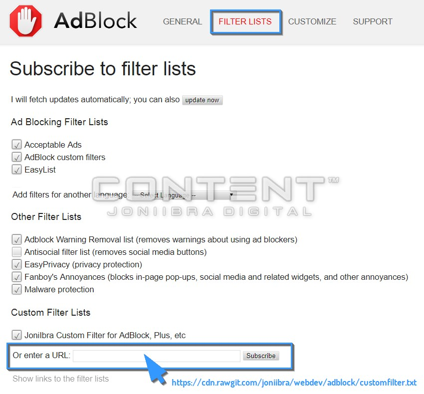

# Ads Block – Custom Filter Lists

### Customize AdBlock – Private Custom Filter Lists

The filter lists block most ads on the web. This is the list what to do:

#### 『 What To Do Lists 』
○  [Ads blocker addon](https://github.com/joniibra/webdev/tree/adblock#add-on-installation-tutorial)
 ○  [Ghostery](https://ghostery.com) extension
 ○  (Optional) [Tampermonkey or Violentmonkey](https://github.com/joniibra/webdev/tree/adblock#more-add-on-installation-optional) extension
 ○  (Optional) [uBlock Protector](https://chrome.google.com/webstore/detail/ublock-protector-extensio/ggolfgbegefeeoocgjbmkembbncoadlb) – Great extension for uBlock Origin only, no anti uBlock warning anymore.

 

## ADD-ON INSTALLATION TUTORIAL

### Step 1: Install Addon
*  [uBlock Origin](https://chrome.google.com/webstore/detail/ublock-origin/cjpalhdlnbpafiamejdnhcphjbkeiagm) –or– [AdBlock](https://chrome.google.com/webstore/detail/adblock/gighmmpiobklfepjocnamgkkbiglidom) for Chrome
*  [uBlock Origin](https://addons.mozilla.org/en-US/firefox/addon/ublock-origin/) –or– [AdBlock](https://addons.mozilla.org/en-US/firefox/addon/adblock-for-firefox/) for Firefox
*  [AdBlock](https://getadblock.com/opera/) for Opera
*  [AdBlock](https://getadblock.com/safari/) for Safari
*  [AdBlock](https://getadblock.com/edge/) for Edge

NOTE:  [uBlock Origin](https://chrome.google.com/webstore/detail/ublock-origin/cjpalhdlnbpafiamejdnhcphjbkeiagm) with [uBlock Protector](https://chrome.google.com/webstore/detail/ublock-protector-extensio/ggolfgbegefeeoocgjbmkembbncoadlb) is my choice, including Ghostery and Violentmonkey.

 

### Step 2: Add Filter List

* [Subscribe from GitLab](https://github.com/joniibra/webdev/blob/adblock/README.md#-my-custom-filter-lists-)

 

#### 『 My Custom Filter Lists 』

 

*  For AdBlock, AdBlock Plus or others ads blocker →
> https://raw.githubusercontent.com/joniibra/webdev/adblock/customfilter.txt 
> or optional – https://cdn.staticaly.com/gh/joniibra/webdev/adblock/ublock.customfilter.txt

*  For uBlock Origin →
> https://raw.githubusercontent.com/joniibra/webdev/adblock/ublock.customfilter.txt 
> or optional – https://cdn.staticaly.com/gh/joniibra/webdev/adblock/ublock.customfilter.txt

 

( This patch already including [uBlockProtectorList](https://raw.githubusercontent.com/jspenguin2017/uBlockProtector/master/uBlockProtectorList.txt) or [NanoDefender](https://raw.githubusercontent.com/NanoAdblocker/NanoFilters/master/NanoMirror/NanoDefender.txt). But if you want more options, you can still add more scripts called [NanoBase](https://jspenguin2017.github.io/uBlockProtector/#extra-installation-steps-for-ublock-origin) by manual installs – Read more.. )

##### Note: You are finished! From this step aim to more neat only if you are ready to install userscripts.

  

## MORE ADD-ON INSTALLATION (OPTIONAL)

### Step 1: Install Userscript

*  [Violentmonkey](https://addons.opera.com/extensions/details/violent-monkey/) or [Tampermonkey](https://addons.opera.com/extensions/details/tampermonkey-beta/)
*  [Violentmonkey](https://addons.mozilla.org/en-US/firefox/addon/violentmonkey/) or [Tampermonkey](https://addons.mozilla.org/firefox/addon/tampermonkey/) or Greasemonkey may optional choice
*  [Tampermonkey](https://safari.tampermonkey.net/tampermonkey.safariextz)
*  [Tampermonkey](https://www.microsoft.com/store/p/tampermonkey/9nblggh5162s)
*  [Violentmonkey](https://chrome.google.com/webstore/detail/violentmonkey/jinjaccalgkegednnccohejagnlnfdag) or [Tampermonkey](https://chrome.google.com/webstore/detail/tampermonkey/dhdgffkkebhmkfjojejmpbldmpobfkfo)

> ##### Notes : [Test: BlockAdBlock](https://blockadblock.com/) – [Test: Antiblock](http://antiblock.org/?p=v3&demo)

 

#### 『 My Custom JavaScript 』

*  For Violentmonkey or Tampermonkey →
> https://cdn.staticaly.com/gh/joniibra/webdev/adblock/adblock.userscript.js

  

## Features
* Detect & Kill Anti-Adblockers
* More filters for ad blockers
* [Settings](https://joniibra.github.io/webdev)
* [Suggest features](https://github.com/joniibra/webdev/adblock/issues)

## Supported Browsers
*  Opera &#10004;
*  FireFox &#10004;
*  Safari &#10004;
*  Edge &#10004;
*  Chrome &#10004; [uBlock Origin](https://github.com/joniibra/webdev/tree/adblock#add-on-installation-tutorial) should work better for you, remember it is not uBlock, but uBlock Origin.

## Supported ad blockers
*  AdBlock &#10004;
*  Adblock Plus &#10004;
*  uBlock Origin &#10004;
* ✖ uBlock ❔ Its not uBlock Origin, I've warned you.
*  Adguard ❔ Me not using this anymore

 

### Help
* Check if you have only one ad blocker enabled. (uBlock Origin, AdBlock, Adblock Plus, etc...).
* Check if the script manager is enabled (Violentmonkey, Tampermonkey, etc...).
* Check if you have installed the latest version of AAK-Cont Script (Step 2).
* Check if you have subscribed to AAK-Cont filter lists (Step 3).
* Check if AAK-Cont Script is enabled.
* Check if AAK-Cont filter lists are enabled.
* Try update or re-install AAK-Cont Script.
* Try update or re-subscribe AAK-Cont filter lists.
* Check if you have another userscript that might interfere with AAK-Cont (e.g. AdBlock Protector, the original (discontinued) AAK).
* These extensions are problematic: Disable Anti-Adblock, Ghostery, Online Security Avast, Donotrackme, Privacy Badger, Disconnect, Blur, TrackerBlock, Kaspersky Anti-Banner, Freebox (Anti-pub), No Script, YesScript, HTTPS Everywhere.
Check if you have it installed, and disable it to see if that fixes the problem.
* Check if, your JavaScript is enabled [Test](http://activatejavascript.org/).
* Remove duplicates AAK-Cont Script / filter lists.
* Remove or disable personal filters.
* Enable only the filter lists you need, too many can cause performance issues.
* Force an update in ad blocker settings.
* Force an update in Script Host settings.
* Try with another browser or script host. Don't want to switch? [Open an issue](https://github.com/joniibra/webdev/adblock/issues) and let us know.
* How write Adblock Plus filters: [click here](https://adblockplus.org/en/filters)
* Where to report missed advertisement: [click here](https://forums.lanik.us/)
* A website does not work? Please report it [here](https://github.com/joniibra/webdev/adblock/issues)
* Need help with installation? Ask for help [here](https://github.com/joniibra/webdev/adblock/issues)

## Anti-adblock scripts that we kill
##### Plugins (Website)
* Antiblock.org V2 & V3
* AntiAdblock (ClemensConrads)
* AntiAdblock (ErikSwan)
* AntiAdblock (D3xt3r)
* RTK Anti Adblock
* Anti Ad Buster
* AADB Anti Ads Blocker
* AdUnBlock Free & Premium
* FuckAdBlock / BlockAdBlock (Sitexw)
* ABT - Ad Block Test
* Block Adblock (thepcspy.com)
* Remove Adblock (removeadblock.com)
* Adblock Detector
* StopAdBlock (stopadblock.org)
* No-Adblock (no-adblock.com)
* AdBuddy
* AdBlockConverter (adblockconverter.com)
* HowToRemoveAdblock (howtoremoveadblock.com)
* BlockAdblock (blockadblock.com)
* TryMask (trymask.com)

##### Plugins (Wordpress)
* AdBlock Blocker
* No Adblock (noadblock.com)
* AdBlock Alerter
* BlockAlyzer - Adblock counter
* Ad Blocking Detector
* AntiBlock (BukssaAyman)
* AdBlock Notify
* WPAdBlock
* Sorry AdBlocker
* FeatureBlock
* DeAdblocker
* NoAdblock Nice Message
* Ad Block Defender
* Ad Blocking Advisor

##### And more!
『 Another Examples of Custom Filter Lists 』

 ○  Subsribes from ABP Official – https://adblockplus.org/subscriptions
 ○  Packages – https://filterlists.com
 ○  IDN: ABPindo – https://raw.githubusercontent.com/ABPindo/indonesianadblockrules/master/subscriptions/abpindo.txt
 ○  AAK-Cont Filters for uBlock Origin – https://xuhaiyang1234.gitlab.io/AAK-Cont
 ○  IDKwhattoputhere/uBlock-Filters-Plus – https://raw.githubusercontent.com/IDKwhattoputhere/uBlock-Filters-Plus/master/uBlock-Filters-Plus.txt
 ○  YouTube: Pure Video Experience – https://easylist-downloads.adblockplus.org/yt_annoyances_full.txt
 ○  NoCoin – https://raw.githubusercontent.com/hoshsadiq/adblock-nocoin-list/master/nocoin.txt

## Like this project?
* Help us resolve issues
* Leave a star
* Let your friends know
* Report issues
